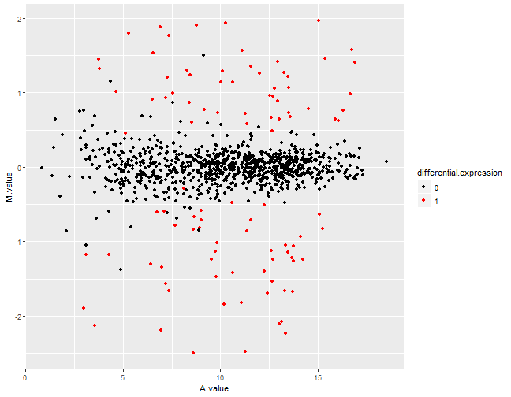
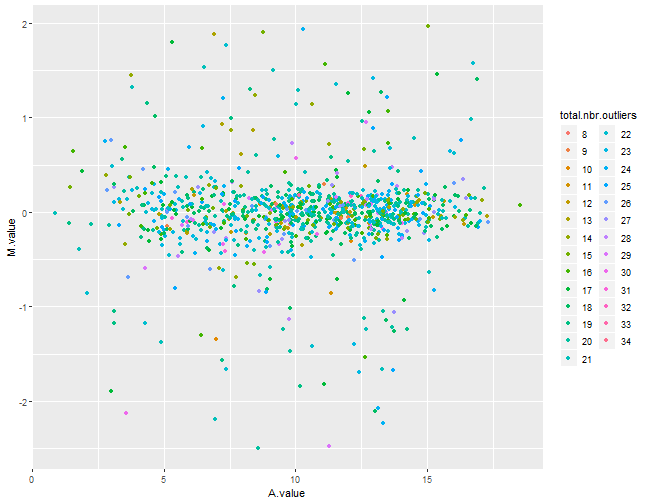
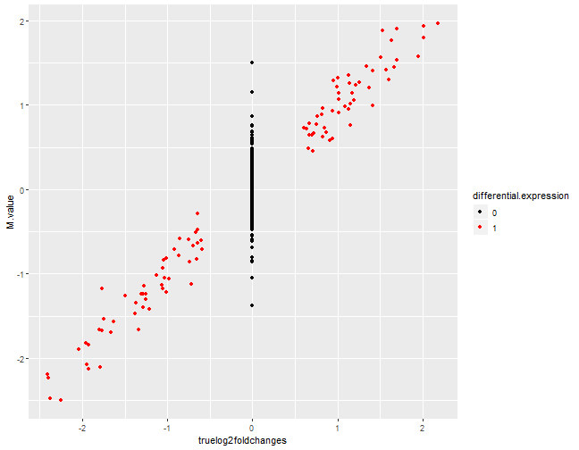

### Summary of synthetic data set

```
## $n.diffexp
## [1] 100
## 
## $fraction.upregulated
## [1] 0.5
## 
## $between.group.diffdisp
## [1] FALSE
## 
## $filter.threshold.total
## [1] 1
## 
## $filter.threshold.mediancpm
## [1] 0
## 
## $fraction.non.overdispersed
## [1] 0
## 
## $random.outlier.high.prob
## [1] 0.05
## 
## $random.outlier.low.prob
## [1] 0.05
## 
## $single.outlier.high.prob
## [1] 0
## 
## $single.outlier.low.prob
## [1] 0
## 
## $effect.size
## [1] 1.5
## 
## $samples.per.cond
## [1] 100
## 
## $repl.id
## [1] 1
## 
## $dataset
## [1] mydat
## 
## $uID
## [1] U3C0xYmGdh
## 
## $seqdepth
## [1] 1e+07
## 
## $minfact
## [1] 0.7
## 
## $maxfact
## [1] 1.4
```


### MA plot, colored by true differential expression status

### MA plot, colored by total number of outliers

### True log2-fold change vs estimated log2-fold change (M-value)

